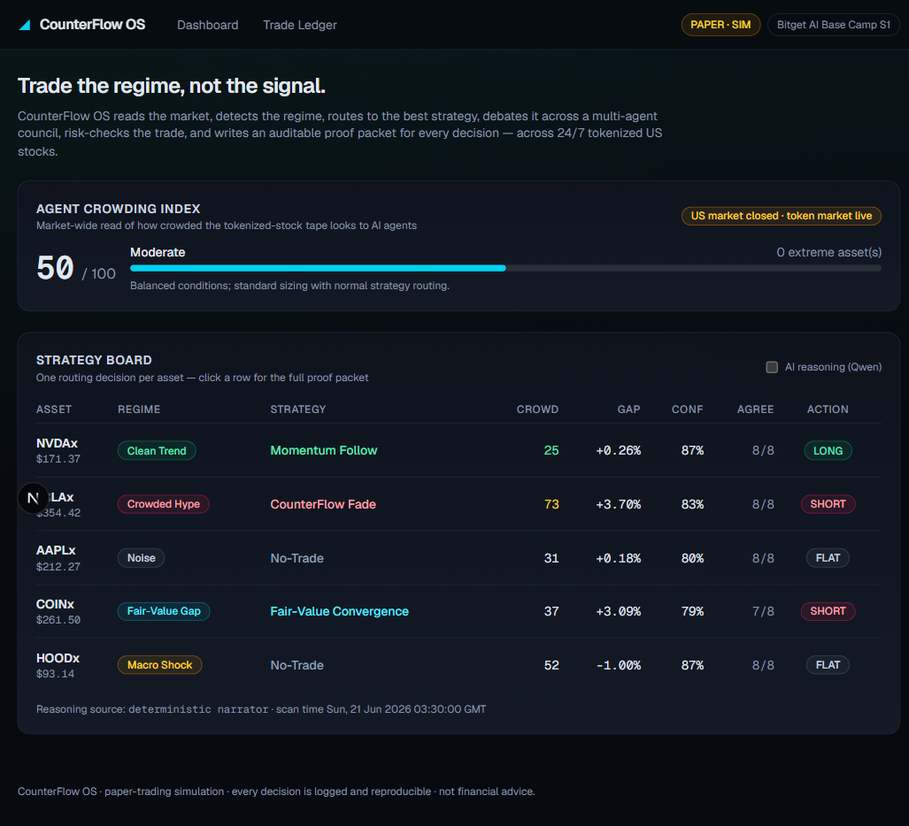
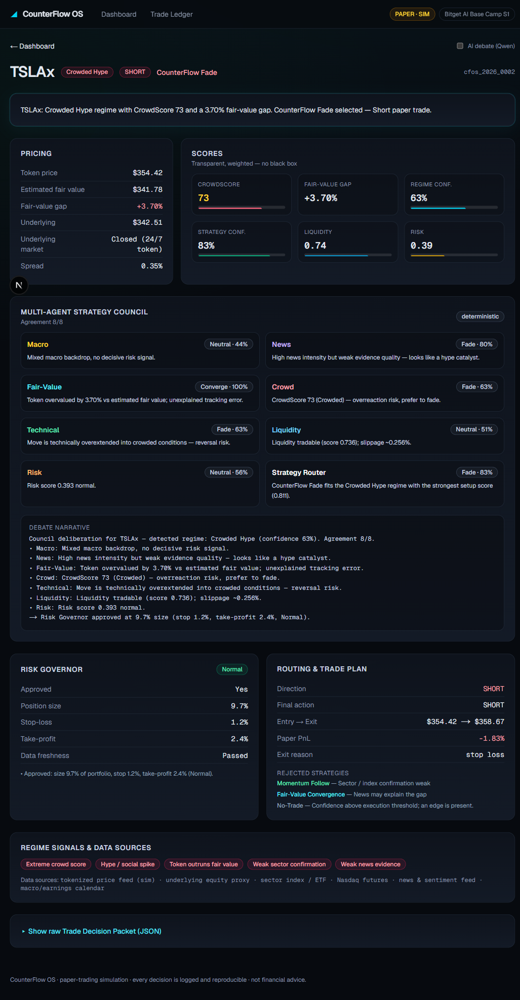
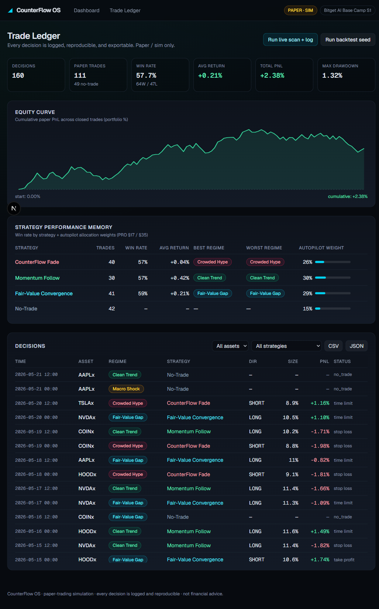

# ◢ CounterFlow OS

**The strategy router for agentic tokenized-equity trading.**
_Trade the regime, not the signal._

CounterFlow OS is an autonomous **strategy-routing and proof layer** for 24/7 tokenized US stock markets. Instead of running one static strategy, it reads the market, **detects the regime**, **routes to the best strategy**, runs a **multi-agent council debate**, applies a **risk governor**, executes a **paper trade**, and writes an **auditable Trade Decision Packet** for every decision — trade _or_ no-trade.

> Built for the **Bitget AI Base Camp Hackathon S1 — Stock AI Trading** track.

**🔗 Live demo: [counterflow-os.vercel.app](https://counterflow-os.vercel.app)** · **Repo: [github.com/Ritik200238/counterflow-os](https://github.com/Ritik200238/counterflow-os)**

> **⚡ Live mode is real.** Toggle "Live" on the board to pull **real tokenized-stock prices from Bitget** (`RNVDAUSDT`, `RTSLAUSDT`, `RAAPLUSDT`, `RCOINUSDT`, `RHOODUSDT`) and **real underlying equity prices from Yahoo Finance** — the fair-value gaps you see are *actual* tokenized-vs-underlying tracking errors, and the spread is the real Bitget order-book spread. Toggle "Demo" for the reproducible six-regime narrative.



---

## Why this exists

Tokenized US stocks trade around the clock, but the underlying US equity market does not. That mismatch creates a new class of inefficiencies — stale fair value, tracking error, thin after-hours liquidity, and **AI/agent crowding** (many bots reacting to the same headlines). In this world, the edge isn't a single strategy. **The edge is knowing which strategy fits the current regime, and when to refuse the trade.**

CounterFlow OS answers four questions for any tokenized-stock decision:

1. **What regime are we in?** (Clean Trend · Crowded Hype · Fair-Value Gap · Macro Shock · Earnings · Noise)
2. **Which strategy has edge here?** (Momentum Follow · CounterFlow Fade · Fair-Value Convergence · No-Trade/Risk-Off)
3. **Is this real alpha or crowded agent noise?** (CrowdScore + market-wide Agent Crowding Index)
4. **Can we prove it was safe, reproducible, and not overfit?** (the Trade Decision Packet + the ledger)

---

## The decision loop

```
observe → detect regime → route strategy → council debate → risk governor
        → paper execute → resolve & log → update strategy performance memory
```

Every step is deterministic and inspectable. An optional LLM layer (Qwen) writes the
human-readable council debate on top of the numbers — it **never changes the decision**,
so results stay reproducible. If the LLM is unavailable, a deterministic narrator takes over
and the product runs identically.

---

## Quickstart

Requirements: **Node 18+** (built on Node 22), npm.

```bash
npm install

# 1) Populate a reproducible backtest ledger (160 paper decisions across regimes)
npm run seed

# 2) Run the dashboard
npm run dev          # http://localhost:3000
```

That's it — no API key required. The engine is fully functional offline; the LLM is an
optional enhancement (see [LLM reasoning](#llm-reasoning-qwen)).

### CLI (reproducible, no browser needed)

```bash
npm run scan          # live strategy board for all 5 assets + crowding index + a full packet
npm run scan -- --llm # same, using Qwen for the debate narrative (falls back automatically)
npm run scan -- --persist   # also resolve + append these decisions to the ledger
npm run seed          # write data/ledger.jsonl from a deterministic backtest
npm run seed -- 300 myseed  # custom decision count + seed
npm run report        # performance report from the on-disk ledger
npm test              # engine invariant suite (reproducibility, scores, regimes, risk)
```

---

## What's inside

### Universe (PRD §9)
`NVDAx · TSLAx · AAPLx · COINx · HOODx` — tokenized US equities chosen for distinct behaviors
(AI momentum, retail crowding, large-cap benchmark, crypto-equity bridge, fintech reflexivity).

### Five proprietary scores (transparent, weighted — every component is shown)
- **CrowdScore** (0–100) — likelihood a move is crowded / bot-driven / overreactive
- **FairValueGap** (%) — token price deviation from estimated fair value
- **RegimeConfidence** (0–1) — confidence in the detected regime (fit margin × data quality)
- **StrategyConfidence** (0–1) — regime fit × council agreement × liquidity
- **LiquidityScore** (0–1) — spread, depth, volatility, freshness → tradable?

### Multi-Agent Strategy Council (PRD §13)
Eight agents — **Macro, News, Fair-Value, Crowd, Technical, Liquidity, Risk, Strategy Router** —
each emit a structured opinion and a normalized stance. Agreement is measured as *active
opposition* (a neutral agent abstains; it doesn't disagree), and surfaces as `6/8`-style counts.



### Risk Governor (PRD §14)
Hard rules (max size 15% / asset, max 60% portfolio exposure, 1.5% per-trade stop cap,
spread/freshness/agreement gates) and risk states **Normal → Caution → Risk-Off → Kill Switch**.
The governor sits *after* the router and can shrink or **block** a selected trade.

### Trade Decision Packet (PRD §32–33)
The core artifact. Every decision produces a structured, auditable packet: regime + signals,
selected and rejected strategies (with reasons), all scores, the full council, agreement,
the risk decision, final action, data freshness/sources, and the reasoning source. See
[`samples/decision-packet-TSLAx.json`](samples/decision-packet-TSLAx.json).

### Paper-Trading Ledger + Strategy Performance Memory (PRD §15, §17, §35)
Every decision is appended to `data/ledger.jsonl` (human-inspectable, exportable to CSV/JSON).
Closed paper trades feed win rate, average return, drawdown, **per-regime performance**, and
**autopilot allocation weights** across strategies.



### Agent Crowding Index (PRD §34)
A market-wide read combining asset CrowdScores, cross-asset move correlation, news intensity,
spread widening, and sector-confirmation weakness → a 0–100 index with a recommended global posture.

---

## API

All routes are Next.js Route Handlers (Node runtime).

| Method & Route | Description |
| --- | --- |
| `GET /api/board?llm=1` | Live strategy board (5 packets) + Agent Crowding Index. `llm=1` enables Qwen reasoning. |
| `POST /api/scan` | LLM-enriched live scan, resolve paper trades, append to ledger. |
| `GET /api/ledger?asset=&strategy=&format=csv` | Ledger entries + stats; CSV/JSON export. |
| `GET /api/strategy-memory` | Strategy Performance Memory + autopilot weights. |
| `GET /api/crowding-index` | Market-wide Agent Crowding Index. |
| `POST /api/seed` | Run a reproducible backtest and (over)write the ledger. Body: `{ decisions?, seed? }`. |

Example:

```bash
curl -s http://localhost:3000/api/board | jq '.decisions[].packet | {asset, marketRegime, selectedStrategy, finalAction}'
```

---

## Architecture

```
src/lib/
  types.ts          # the shared domain model (the contract)
  market/           # seeded, reproducible market generator (assets + scenarios)
  scores.ts         # CrowdScore, FairValueGap, LiquidityScore, RiskScore
  regime.ts         # rule-based regime detection (6 regimes) + RegimeConfidence
  council.ts        # 7 sensing/risk agents + agreement metric
  router.ts         # strategy selection + rejected reasons + StrategyConfidence
  governor.ts       # risk governor: hard rules, states, sizing, block/shrink
  executor.ts       # paper-trade resolution vs the forward price path
  ledger/           # JSONL store + CSV export
  memory.ts         # performance memory, autopilot weights, ledger stats
  crowding.ts       # market-wide Agent Crowding Index
  llm/              # Qwen (DashScope) client + reasoning layer (+ deterministic fallback)
  pipeline.ts       # composes everything into a Trade Decision Packet
  seed.ts           # deterministic backtest runner
src/app/            # Next.js dashboard (board, asset detail, ledger) + API routes
scripts/            # CLI: scan / seed / report
```

### Reproducibility & honesty

- **`npm test`** — 200 assertions covering reproducibility, score ranges, regime detection, router/risk invariants, and ledger accounting (all green).
- **Seeded RNG everywhere** — same seed ⇒ same market ⇒ same decisions ⇒ same ledger.
- **Honest edge model** — backtested win rates land in a believable ~55–60% range with real
  cost/slippage drag; nothing is tuned to look perfect (PRD §6: no cherry-picking, no fake precision).
- **Paper / sim only** — no real capital, no profit promises. Market data is simulated and
  clearly labeled `PAPER · SIM` throughout.

---

## LLM reasoning (Qwen)

The reasoning layer calls **Alibaba Cloud Qwen** via the DashScope OpenAI-compatible endpoint to
write the council debate narrative. Configure in `.env`:

```bash
DASHSCOPE_API_KEY=your_key      # or QWEN_API_KEY
QWEN_MODEL=qwen-plus            # optional (default qwen-plus)
QWEN_BASE_URL=https://dashscope-intl.aliyuncs.com/compatible-mode/v1  # optional
```

If no key is set — or the call fails — CounterFlow OS automatically uses its **deterministic
narrator** and runs identically. The LLM only ever writes prose; it cannot change a number,
a regime, a strategy, or a risk decision.

---

## Tech stack

Next.js 16 (App Router) · React 19 · TypeScript · Tailwind v4 · Qwen via DashScope · JSONL ledger.

## Disclaimer

CounterFlow OS is a **paper-trading simulation** for research and demonstration. It does not
trade real capital and is **not financial advice**.
